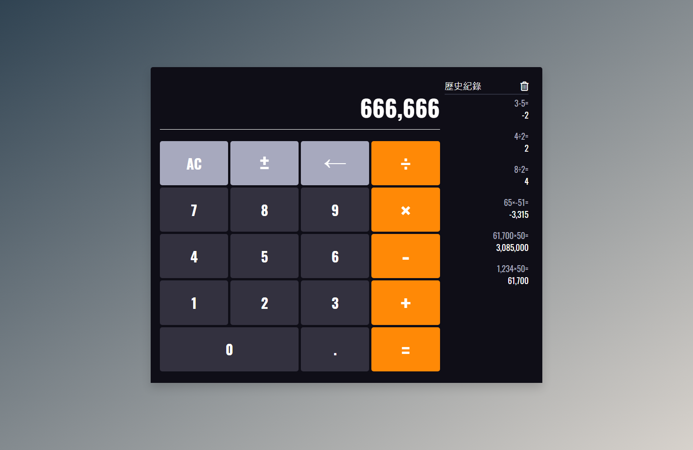

 
  

  <h1>Vanilla JavaScript Calculator</h1>
  <a href="https://vanilla-js-calculator-try-it.netlify.app/" target="_blank">Demo</a>

&#xa0;

  

  

  

  <a href="#dart-about">About</a> &#xa0; | &#xa0; 
  <a href="#sparkles-features">Features</a> &#xa0; | &#xa0;
  <a href="#books-learn">Learn</a>

 

## :dart: About

嘗試使用原生 JavaScript 製作出的有基本四則運算等功能的計算機。

## :sparkles: Features

:heavy_check_mark: 可用點擊按鈕或鍵盤來操作計算機  
:heavy_check_mark: 響應式 RWD  
:heavy_check_mark: 可記錄每筆計算結果  
:heavy_check_mark: 累加計算等操作  

## :books: Learn

#### 收穫

1. 熟悉`if` `switch`兩種條件句的使用時機。
2. 學習各樣監聽事件，如`keydown`、`click`、`transitionend`等。
3. `string`與`number`型別處理

#### 反思

原本想說只是基本的四則運算的計算機的話應該不會太難，結果發現邏輯比想像中的還複雜，前個按鈕與現在按下的按鈕間的條件判斷、每個按鈕的功能、字串與數字的型別處理很多都環環相扣，很多邏輯也是在多次測試中才發現沒有處理到的。
雖然只是個小 project 但過程中意外地有趣也遇到不少挑戰，大概是人生中按計算機按最久的一次了:smile::smile:。

---

Made by <a href="https://github.com/yuRicky09" 
target="_blank">yuRicky09</a>

<a href="#top">Back to top</a>
